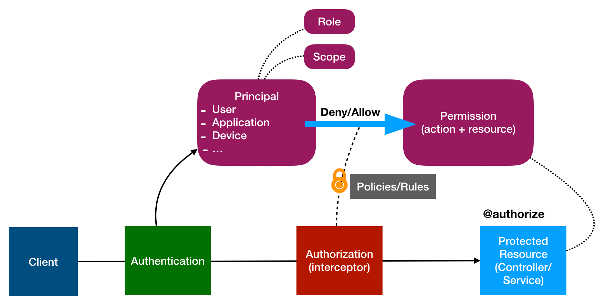
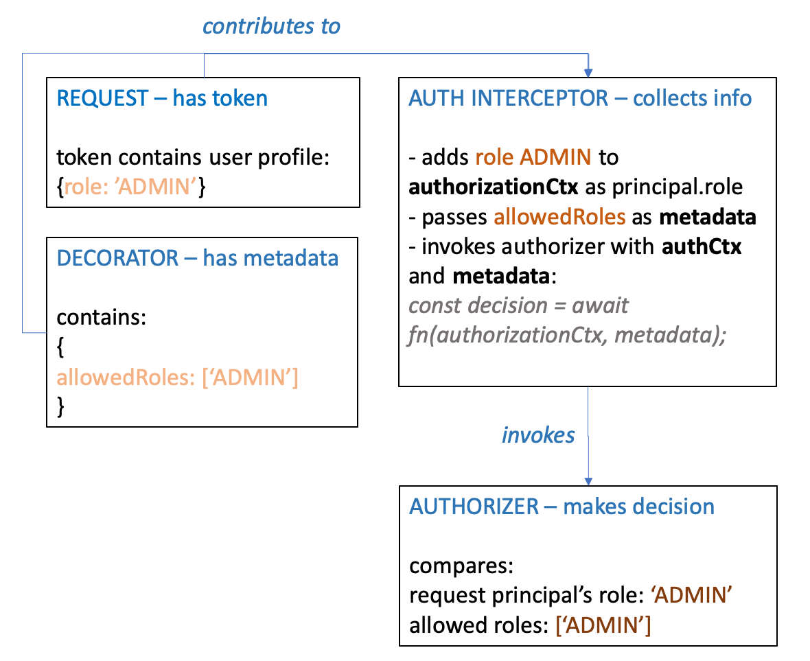

# @loopback/authorization

A LoopBack 4 component for authorization support (Role based, Permission based,
Vote based)

To read on key building blocks read through
[loopback authorization docs](https://loopback.io/doc/en/lb4/Loopback-component-authorization.html)



## Installation

```shell
npm install --save @loopback/authorization
```

## Basic use

The following example shows the basic use of `@authorize` decorator, authorizer
and authorization component by authorizing a client according to its role:

ASSUMING your app uses jwt as the authentication strategy, and the user
information is encoded in the token from a request's header.

### Define Role Property

First **define `role` as a property in your User model** so that after a user
logs in, the client's requests will contain that user's role.

```ts
@model()
export class User extends Entity {
  @property({
    type: 'string',
    id: true,
  })
  id: string;

  @property({
    type: 'string',
    id: true,
  })
  role: string;
```

### Decorate Controller Method

Then **decorating your controller methods with `@authorize`** to require the
request to be authorized.

```ts
import {inject} from '@loopback/context';
import {authorize} from '@loopback/authorization';
import {get} from '@loopback/rest';

export class MyController {
  // user with ADMIN role can see the number of views
  @authorize({allowRoles: ['ADMIN']})
  @get('/number-of-views')
  numOfViews(): number {
    return 100;
  }
}
```

### Create Authorizer Provider

Next **create an authorizer provider** that compares the request sender's role
and the visited endpoint's allowed roles, and returns decision ALLOW if they
match.

```ts
export class MyAuthorizationProvider implements Provider<Authorizer> {
  constructor() {}

  /**
   * @returns authenticateFn
   */
  value(): Authorizer {
    return this.authorize.bind(this);
  }

  async authorize(
    authorizationCtx: AuthorizationContext,
    metadata: AuthorizationMetadata,
  ) {
    const clientRole = authorizationCtx.principals[0].role;
    const allowedRoles = metadata.allowedRoles;
    return allowedRoles.includes(clientRole)
      ? AuthorizationDecision.ALLOW
      : AuthorizationDecision.DENY;
  }
}
```

Finally, **bind the authorizer and mount the authorization component** to your
application. The authorization component can be configured with options:

```ts
const options: AuthorizationOptions = {
  precedence: AuthorizationDecisions.DENY;
  defaultDecision: AuthorizationDecisions.DENY;
}

const binding = app.component(AuthorizationComponent);
app.configure(binding.key).to(options);

app.bind('authorizationProviders.my-authorizer-provider')
      .toProvider(MyAuthorizationProvider)
      .tag(AuthorizationTags.AUTHORIZER);

```

After setting up the authorization system, you can create a user with role
`ADMIN`, login and get the token, then visit endpoint `GET /number-of-views`
with the generated token in the request header.

### Summary and Diagram

Here is a summary of the use case and diagram for the example:

Endpoint: GET /number-of-views

Controller method:

```ts
@authenticate(‘jwt’)
@authorize({allowRoles: ['ADMIN']})
@get('/number-of-views')
numOfViews(): number {
  return 100;
}
```

Use case:


Authorization artifacts' responsibilities:



## Extract common layer

`@loopback/authentication` and `@loopback/authorization` share the client
information from the request. Therefore we have created another module,
`@loopback/security` with types/interfaces that describe the client, like
`principles`, `userProfile`, etc.

## Related resources

## Contributions

- [Guidelines](https://github.com/strongloop/loopback-next/blob/master/docs/CONTRIBUTING.md)
- [Join the team](https://github.com/strongloop/loopback-next/issues/110)

## Tests

run `npm test` from the root folder.

## Contributors

See
[all contributors](https://github.com/strongloop/loopback-next/graphs/contributors).

## License

MIT
