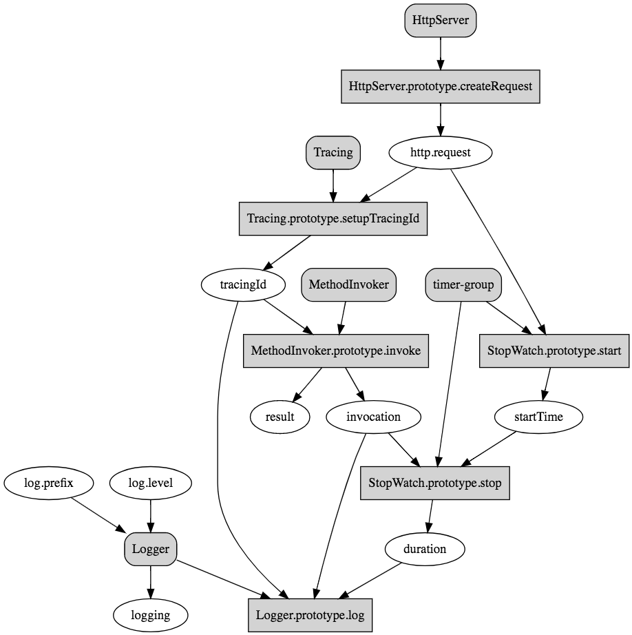

# Feature: Action - declare action classes and methods

- In order to define actions and compose them into a sequence
- As an extension developer
- I want to declare action classes with one or more methods to provide
  information about what the action depends on and fulfills
- So that such attributes can be used to determine the order to resolve action
  classes and invoke action methods

## Scenario: Declare action classes

- Given a context
- Given a class `Logger` with `@action` to mark it as an action class and
  supply information about the dependencies
- Given `Logger` ctor argument is decorated with `@inject('log.prefix')`
- Given `Logger` `level` property is decorated with `@inject('log.prefix')`

```ts
/**
 * Log the tracing id and duration for a given http request
 */
@action({fulfills: ['logging']})
class Logger {
  /**
   * @param prefix The logging prefix
   */
  constructor(@inject('log.prefix') private prefix: string) {}

  /**
   * The logging level
   */
  @inject('log.level') level: string = 'INFO';

  // ...
}
```

```ts
/**
 * StopWatch records duration for a request. There are two action methods:
 * - start: Start the timer
 * - stop: Stop the timer and calculates the duration
 */
@action({group: 'RoundtripTimer'})
class StopWatch {
  // ...
}
```

## Scenario: Declare action methods

```ts
@action({group: 'RoundtripTimer'})
class StopWatch {
  /**
   * Start the timer (only to be invoked after http.request is set up)
   * @param startTime Use a setter to bind `startTime`
   */
  @action({dependsOn: ['http.request']})
  start(@inject.setter('startTime') startTime: Setter<Date>) {
    startTime(new Date());
  }

  /**
   * Calculate the duration
   * @param startTime
   */
  @action({bindsReturnValueAs: 'duration', dependsOn: ['invocation']})
  stop(@inject('startTime') startTime: Date): number {
    return new Date().getTime() - startTime.getTime();
  }
}
```

## Scenario: Controller scoped action methods

- Given a controller
- Add action methods to be invoked as part of the sequence to invoke controller
  methods

```
class HellController {

  @action({fulfills: ['hello']})
  preHello() {
    console.log('preHello');
  }

  hello(@inject('user') user: string): string {
    return `Hello, ${user}`;
  }

  @action({dependsOn: ['hello']})
  postHello() {
    console.log('postHello');
  }

}
```

## Scenario: Sort action classes and methods

The action classes are sorted based on two attributes:

- `dependsOn`: An array of group names representing dependencies
- `fulfills`: An array of group names representing the action class fulfills

These two attributes can be explicitly declared with `@action`, for example:

```
@action({group: 'my-group', dependsOn: ['a', 'b'], fulfills: ['x', 'y']})
class MyAction {
  // ...
}
```

If the `group` is not present, it will be derived as follows:
- class:<className> for action classes
- method:<className>.<staticMethodName> for static action methods
- method:<className>.<prototype>.<prototypeMethodName> for prototype action
  methods

If one or more method parameters are decorated with `@inject`, the corresponding
keys will be merged into `dependsOn`. For those parameters decorated with
`@inject.setter`, their keys will be added to `fulfills`.

The method level `@action` can also optionally specify `bindReturnValueAs` to
specify a key for the return value of the method invocation to be bound the
context. The key will be added to `fulfills` too.

The fully populated `dependsOn` and `fulfills` create a partial order for the
action class/method. For example:

['a', 'b] > 'my-group' > ['x', 'y']

Action classes and methods can be then be sorted using
[topological sorting](https://en.wikipedia.org/wiki/Topological_sorting).



**NOTE**: Maybe we should add `publishes` and `subscribes` attributes to support
cases when an action is only triggered by certain events.

## Scenario: Compose action classes and methods

Sorted action classes will be bound to the context:

```ts
const actions = sortActions(
  [Logger, StopWatch, HttpServer, MethodInvoker, Tracing],
  true,
  true,
);

for (const c of actions.filter((a: any) => !a.method)) {
  ctx
    .bind('actions.' + c.target.name)
    .toClass(c.target)
    .inScope(BindingScope.SINGLETON);
}
```

Sorted action methods are then invoked one by one to create a sequence of
actions. For example:

```ts
for (const m of actions.filter((a: any) => !!a.method)) {
  const v = await ctx.get('actions.' + m.actionClass.name);
  const result = await invokeMethod(v, m.method, ctx);
  if (result !== undefined && m.bindsReturnValueAs) {
    ctx.bind(m.bindsReturnValueAs).to(result);
  }
}
```

## Scenario: Different action styles

- One-way (similar as Express middleware, can be phase-based)
- Cascading (similar as Koa middleware, the action itself is responsible for
  calling the next one, for example, `await next()`)
- Result and error handling
