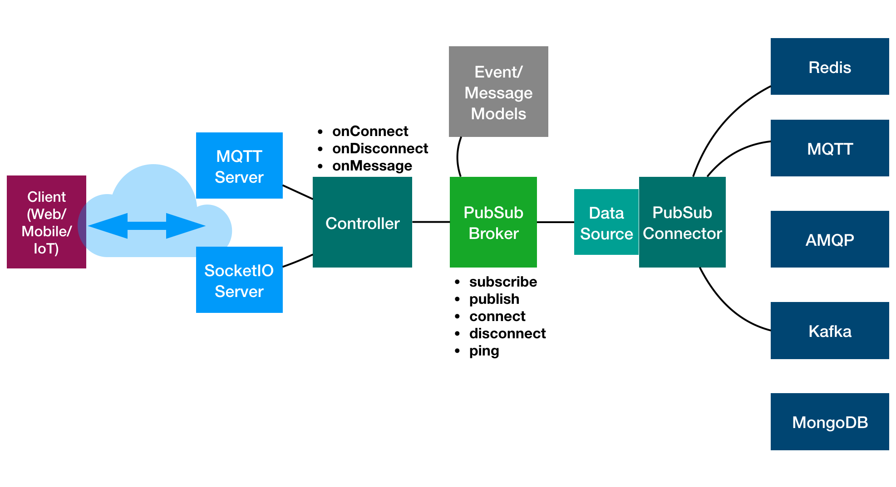

# @loopback/pubsub

Publish/subscribe for LoopBack 4

## Installation

```sh
npm install --save @loopback/pubsub
```

## Overview



## Basic use

## Contributions

- [Guidelines](https://github.com/strongloop/loopback-next/blob/master/docs/CONTRIBUTING.md)
- [Join the team](https://github.com/strongloop/loopback-next/issues/110)

## Tests

run `npm test` from the root folder.

## Contributors

See
[all contributors](https://github.com/strongloop/loopback-next/graphs/contributors).

## License

MIT
