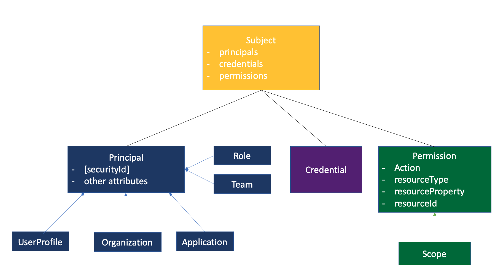

# @loopback/security

Common types/interfaces for LoopBack 4 security including authentication and
authorization.

## Installation

```shell
npm install --save @loopback/security
```

## Overview

- Subject
  - It's the "who" for security
  - contains a set of Principles, a set of Credentials, and a set of Permissions
- Principle
  - Represent a user, an application, or a device
- Credential
  - Security attributes used to authenticate the subject. Such credentials
    include passwords, Kerberos tickets, and public key certificates.
- Permission
  - It's the `what` for security.



## Basic use

## Contributions

- [Guidelines](https://github.com/strongloop/loopback-next/blob/master/docs/CONTRIBUTING.md)
- [Join the team](https://github.com/strongloop/loopback-next/issues/110)

## Tests

run `npm test` from the root folder.

## Contributors

See
[all contributors](https://github.com/strongloop/loopback-next/graphs/contributors).

## License

MIT
